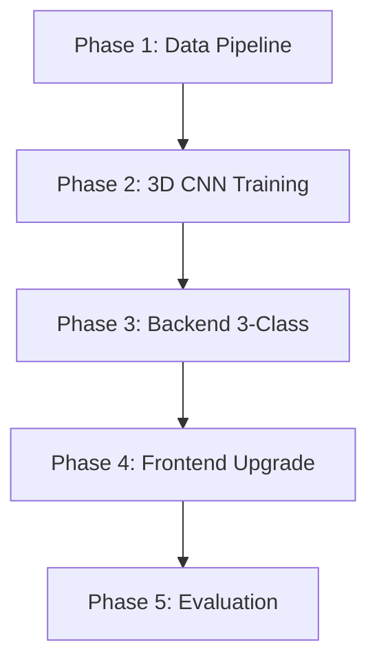

# Plan: Face Recognition → Heart Label → 3D Heart Simulation Upgrade

## Background & Context

### Trạng thái hiện tại của dự án

| Component | Status | Details |
|-----------|--------|---------|
| **2D CNN (EfficientNet-B4)** | ✅ Built | `classifier_2d.py` — binary Pain/NoPain, model trained (74MB) |
| **3D CNN (ResNet3D-18)** | ✅ Scaffold | `classifier_3d.py` — code exists nhưng chưa train |
| **SynPAIN Loader** | ✅ Built | `synpain_loader.py` — HuggingFace loader, binary labels |
| **Data Collector** | ✅ Built | `data_collector.py` — webcam + folder import, 3-class dirs |
| **Trainer** | ✅ Built | `trainer.py` — 2-phase, mixed precision, early stopping |
| **Heartbeat Engine** | ✅ Built | `heartbeat_engine.py` — BPM→animation, 3 patterns |
| **3D Heart Viewer** | ✅ Built | `heart-viewer.js` — GPU vertex shader, 7 cardiac mechanics |
| **FastAPI Backend** | ✅ Built | `app.py` — predict endpoint, binary model |
| **Face Dataset (3-class)** | ❌ Missing | Chưa có dataset normal/abnormal/infarction |
| **3D CNN Training** | ❌ Missing | Chưa có video dataset, chưa train |
| **3-class Integration** | ❌ Missing | Backend/Frontend chỉ binary, cần upgrade |

### Luồng xử lý mục tiêu
```
Khuôn mặt (ảnh/video)
  → Face Detection (MediaPipe)
  → AI Classification (2D CNN hoặc 3D CNN)
  → Nhãn: normal | abnormal | infarction
  → BPM: 60-80 | <60/>100 | 90-130
  → 3D Heart Simulation (Three.js GPU Shader)
  → ECG Waveform tương ứng
```

---

## 🛑 Open Questions

> [!IMPORTANT]
> **Q1: Nguồn dữ liệu khuôn mặt 3 nhãn?**
>
> Hiện chỉ có SynPAIN (binary Pain/NoPain). Để train 3-class cần ≥500 ảnh/nhãn.
>
> | Option | Approach | Pros | Cons |
> |--------|----------|------|------|
> | **A** | Tự thu thập webcam + gán nhãn giả lập | Kiểm soát được | Tốn thời gian |
> | **B** | SynPAIN + augmentation tạo class "abnormal" | Nhanh | Không tự nhiên |
> | **C** | Transfer learning: pre-train binary → fine-tune 3-class | Tốt nhất | Cần data sau |
> | **D** | Kết hợp: SynPAIN + synthetic + webcam | Đa dạng nhất | Phức tạp |
>
> **Recommend: Option D**

> [!IMPORTANT]
> **Q2: 3D CNN — video thật hay ảnh sequence?**
>
> `classifier_3d.py` dùng ResNet3D-18, input `(B, 3, 16, 224, 224)` = 16 frames.
> Bạn muốn thu thập **video ngắn** (2-3s webcam) hay dùng **ảnh sequence giả lập**?

> [!IMPORTANT]
> **Q3: Ưu tiên phase nào trước?**
>
> | Priority | Task | Est. Time |
> |----------|------|-----------|
> | A | Thu thập data + gán nhãn 3-class | 1-2 tuần |
> | B | Train 3D CNN (dùng synthetic data) | 3-5 ngày |
> | C | Upgrade frontend 3-class trước (demo) | 1-2 ngày |

---

## Proposed Changes

### Phase 1: Data Collection & 3-Class Labeling

#### [MODIFY] [data_collector.py](file:///d:/Antigravity/-3D-Heart-Simulation/src/data/data_collector.py)
- Thêm `capture_video_clip()` — record 2-3s → extract 16 frames cho 3D CNN
- Thêm metadata: timestamp, expression, label

#### [NEW] `src/data/video_dataset.py`
- PyTorch Dataset cho video: `(B, 3, 16, 224, 224)`
- Load 16-frame sequences từ video/image folders
- Video augmentation: temporal jitter, spatial transforms

#### [MODIFY] [label_manager.py](file:///d:/Antigravity/-3D-Heart-Simulation/src/data/label_manager.py)
- Extend label system với BPM range mapping
- Validation rules cho label consistency

#### [NEW] `scripts/collect_faces.py`
- Interactive script: chọn nhãn → webcam capture → face-crop → save

---

### Phase 2: 3D CNN Training Pipeline

#### [MODIFY] [classifier_3d.py](file:///d:/Antigravity/-3D-Heart-Simulation/src/models/classifier_3d.py)
- Thêm `freeze_backbone()` / `unfreeze_backbone()`
- Thêm `from_checkpoint()` class method

#### [NEW] `configs/train_3dcnn_config.yaml`
- Config riêng cho 3D CNN: backbone=r3d_18, num_classes=3, batch_size=8

#### [NEW] `scripts/train_3dcnn.py`
- Entry point: load video dataset → 2-phase training → save checkpoint

#### [MODIFY] [trainer.py](file:///d:/Antigravity/-3D-Heart-Simulation/src/models/trainer.py)
- Thêm per-class accuracy logging
- Thêm 3D input shape validation

---

### Phase 3: Backend Upgrade (Binary → 3-Class)

#### [MODIFY] [predictor.py](file:///d:/Antigravity/-3D-Heart-Simulation/src/models/predictor.py)
- Thêm `HeartPredictor3D` cho video input
- Support cả 2D (image) và 3D (video) prediction
- Output 3 labels: normal/abnormal/infarction

#### [MODIFY] [app.py](file:///d:/Antigravity/-3D-Heart-Simulation/src/web/app.py)
- Upgrade labels từ 2-class → 3-class
- Thêm `POST /api/predict-video`
- Thêm model selector (2D/3D CNN)
- Update BPM mapping 3 nhãn

#### [MODIFY] [heartbeat_engine.py](file:///d:/Antigravity/-3D-Heart-Simulation/src/heart_simulation/heartbeat_engine.py)
- Thêm `CONDITION_PROFILES` chi tiết:
  - normal: systole=0.33, jitter=0%
  - abnormal: systole varies, jitter=15%, skip=10%
  - infarction: systole=0.40, jitter=20%, wall_motion_abnormality

---

### Phase 4: Frontend 3D Heart Upgrade

#### [MODIFY] [heart-viewer.js](file:///d:/Antigravity/-3D-Heart-Simulation/frontend/src/heart-viewer.js)
- 3 condition configs rõ ràng (squeeze, twist, tremor, color)
- Damaged zone rendering cho infarction
- Irregular beat timing cho abnormal

#### [MODIFY] [main.js](file:///d:/Antigravity/-3D-Heart-Simulation/frontend/src/main.js)
- `displayResult()` cho 3 nhãn
- Video upload support
- Model type selector (2D/3D)
- Probability bars 3 classes

#### [MODIFY] [ecg-renderer.js](file:///d:/Antigravity/-3D-Heart-Simulation/frontend/src/ecg-renderer.js)
- ECG pattern cho abnormal (irregular intervals)
- Differentiate waveform shapes per condition

#### [MODIFY] `frontend/index.html`
- Video upload zone + model selector
- Condition selector: 3 options
- Comparison view: 3 trạng thái tim

---

### Phase 5: Evaluation & Testing

#### [NEW] `scripts/evaluate_3dcnn.py`
- Confusion matrix 3×3, ROC curves, 2D vs 3D comparison

#### [NEW] `tests/test_3dcnn_pipeline.py`
- Test video dataset, 3D CNN forward pass, freeze/unfreeze, 3-class output

---

## File Summary

| Action | Count | Files |
|--------|-------|-------|
| **NEW** | 7 | video_dataset.py, collect_faces.py, train_3dcnn_config.yaml, train_3dcnn.py, evaluate_3dcnn.py, test_3dcnn_pipeline.py |
| **MODIFY** | 10 | data_collector.py, label_manager.py, classifier_3d.py, trainer.py, predictor.py, app.py, heartbeat_engine.py, heart-viewer.js, main.js, ecg-renderer.js, index.html |

---

## Execution Order



| Phase | Est. Time | Agent |
|-------|-----------|-------|
| 1. Data Pipeline | 2-3 hours | backend-specialist |
| 2. 3D CNN Training code | 2-3 hours | backend-specialist |
| 3. Backend Upgrade | 1-2 hours | backend-specialist |
| 4. Frontend Upgrade | 2-3 hours | frontend-specialist |
| 5. Evaluation | 1-2 hours | backend-specialist |
| **Total coding** | **~10 hours** | |
| Data collection (manual) | Days-weeks | User |
| GPU training | 2-6 hours | RTX 3080 |

---

## Verification Plan

```bash
# Unit tests
pytest tests/test_3dcnn_pipeline.py -v
pytest tests/ -v  # no regression

# Manual: collect → train → predict → view 3D
python scripts/collect_faces.py --label normal --num 10
python scripts/train_3dcnn.py --epochs 2
# Start frontend + backend, upload face, verify 3-class output + 3D heart
```

| Metric | Target |
|--------|--------|
| 3D CNN output shape | ✅ (B, 3) |
| 3-class prediction API | ✅ normal/abnormal/infarction |
| Heart viewer 3 conditions | ✅ Visual difference |
| ECG 3 patterns | ✅ Different waveforms |
| Video upload | ✅ End-to-end works |
| Existing tests | ✅ No regression |
