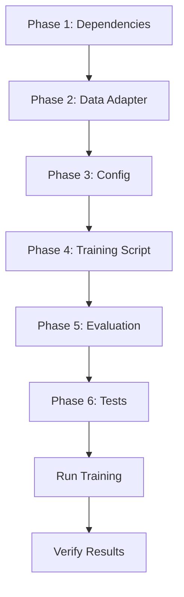

# Plan: SynPAIN Dataset Integration — Training, Testing & Evaluation

## Background & Context

### Your Project
**Heart Condition Detection & 3D Simulation** — classifies heart conditions from facial images using a CNN (EfficientNet-B4/ResNet-50) with 3 output labels:

| Label | ID | BPM Range | Description |
|-------|-----|-----------|-------------|
| `normal` | 0 | 60-80 | Healthy heart |
| `abnormal` | 1 | <60 / >100 | Arrhythmia |
| `infarction` | 2 | 90-130 | Myocardial Infarction |

### SynPAIN Dataset (TaatiTeam/SynPAIN)
A synthetic facial expression dataset from Hugging Face designed for **automated pain detection**:

| Property | Value |
|----------|-------|
| **Total images** | 10,710 (5,355 neutral/expressive pairs) |
| **HF train split** | 3,900 examples |
| **Size** | ~5 GB (Parquet) |
| **HF Schema** | `image` (Image), `label` (ClassLabel: "Images" / "Videos") |
| **Filename format** | `[ID]_[expression]_[gender]_[age].jpg` |
| **Expression types** | `Pain`, `NoPain` (includes neutral pairs) |
| **Demographics** | 5 ethnicities × 2 ages (Young 20-35, Old 75+) × 2 genders |
| **ID encoding** | `1[pain][gender][age][ethnicity][5-digit-id]` |

---

## User Review Required

> [!IMPORTANT]
> **Domain Gap: SynPAIN ≠ Heart Condition Labels**
>
> SynPAIN labels are **Pain / NoPain** (binary), while your project uses **normal / abnormal / infarction** (3-class).
> These are fundamentally different classification tasks, but facial pain expressions share visual features with cardiac distress (grimacing, pallor, sweating).
>
> The plan below proposes a **label mapping strategy** — please review carefully and decide which approach you prefer.

> [!WARNING]
> **SynPAIN `label` column on HuggingFace is "Images" vs "Videos"** — this is the *folder source*, NOT the pain label.
> The actual pain/no-pain label must be **parsed from the filename** (`[ID]_Pain_...` or `[ID]_NoPain_...`).

---

## Open Questions

> [!IMPORTANT]
> **Q1: Label Mapping Strategy** — Which approach do you prefer?
>
> | Strategy | Mapping | Pros | Cons |
> |----------|---------|------|------|
> | **A) Binary → 3-class** | Pain→`infarction`, NoPain→`normal`, generate `abnormal` via augmentation | Uses all 3 project labels | `abnormal` class is synthetic/artificial |
> | **B) Binary only** | Pain→`pain`, NoPain→`no_pain`, change model to 2-class | Clean, honest mapping | Requires changing `num_classes=2`, breaks 3D BPM mapping |
> | **C) Transfer Learning** | Pre-train on SynPAIN (2-class Pain/NoPain), then fine-tune on your own 3-class data later | Best of both worlds | Needs your own labeled data eventually |
>
> **Recommended: Strategy C** — use SynPAIN for feature learning (facial distress patterns), then fine-tune on your real 3-class dataset.

> [!IMPORTANT]
> **Q2: Do you have your own labeled dataset?**
> If YES → Strategy C is ideal (pre-train on SynPAIN → fine-tune on yours).
> If NO → Strategy A or B is the practical choice for now.

> [!IMPORTANT]
> **Q3: GPU availability?**
> SynPAIN is ~5GB of images. Training EfficientNet-B4 with 10K+ images requires a GPU with ≥6GB VRAM.
> Do you have CUDA available? Should we configure CPU fallback?

---

## Proposed Changes

### Phase 1: Environment Setup & Dependencies

#### [MODIFY] [requirements.txt](file:///d:/Antigravity/-3D-Heart-Simulation/requirements.txt)
Add HuggingFace `datasets` library (needed to load SynPAIN):

```diff
 # Utilities
 tqdm>=4.66.0
 loguru>=0.7.2
+
+# HuggingFace Dataset Loading
+datasets>=3.0.0
+huggingface-hub>=0.20.0
```

**Command to install:**
```bash
pip install datasets huggingface-hub
```

---

### Phase 2: SynPAIN Data Adapter

#### [NEW] [synpain_loader.py](file:///d:/Antigravity/-3D-Heart-Simulation/src/data/synpain_loader.py)

New module that handles all SynPAIN-specific logic:

```
Key responsibilities:
├── download_synpain()          # Download via HF datasets API
├── parse_filename_metadata()   # Extract pain/gender/age/ethnicity from filename
├── filter_images_only()        # Skip videos, keep only image entries
├── create_label_mapping()      # Map Pain/NoPain → project labels
├── SynPainDataset(Dataset)     # PyTorch Dataset wrapping HF data
└── create_synpain_loaders()    # Build train/val/test DataLoaders
```

**Data loading flow:**
```
HF API → load_dataset("TaatiTeam/SynPAIN")
  → filter(label == "Images")       # Remove video entries
  → parse filename → extract Pain/NoPain
  → map to project labels
  → apply augmentation transforms
  → return (tensor, label_id)
```

**Filename parsing logic:**
```python
# Filename: "1100300001_Pain_Man_Young.jpg"
# ID breakdown: 1[1][0][0][3][00001]
#                 ↑pain ↑man ↑young ↑caucasian

def parse_synpain_filename(filename: str) -> dict:
    parts = filename.stem.split("_")
    return {
        "id": parts[0],
        "expression": parts[1],      # "Pain" or "NoPain"
        "gender": parts[2],           # "Man" or "Woman"  
        "age": parts[3],              # "Young" or "Old"
        "is_pain": parts[1] == "Pain",
    }
```

**Label mapping (Strategy C — recommended):**
```python
# Phase 1: Pre-training (binary)
SYNPAIN_LABEL_MAP_BINARY = {"NoPain": 0, "Pain": 1}

# Phase 2: 3-class mapping (for transfer learning baseline)
SYNPAIN_LABEL_MAP_3CLASS = {
    "NoPain": 0,   # → normal
    "Pain": 2,     # → infarction (most severe facial distress)
    # abnormal class: not directly available, generated via augmentation
}
```

---

### Phase 3: Training Configuration

#### [NEW] [synpain_config.yaml](file:///d:/Antigravity/-3D-Heart-Simulation/configs/synpain_config.yaml)

Dedicated config for SynPAIN training experiments:

```yaml
# SynPAIN Training Configuration
dataset:
  name: "TaatiTeam/SynPAIN"
  cache_dir: "data/synpain_cache"
  filter_type: "Images"       # Skip video entries
  label_strategy: "binary"    # "binary" | "3class" | "transfer"

model:
  backbone: efficientnet_b4
  num_classes: 2              # Binary for Phase 1 (Pain/NoPain)
  pretrained: true
  dropout: 0.3
  freeze_epochs: 5            # Freeze backbone for first N epochs

data:
  image_size: 224
  batch_size: 16              # Smaller for 5GB dataset
  num_workers: 4
  train_split: 0.7
  val_split: 0.15
  test_split: 0.15
  stratify_by: "expression"   # Stratify by Pain/NoPain
  balance_demographics: true  # Ensure age/gender/ethnicity balance

training:
  epochs: 30
  learning_rate: 0.00005      # Lower LR for synthetic data
  weight_decay: 0.00001
  optimizer: adamw
  scheduler: cosine
  early_stopping_patience: 8
  mixed_precision: true
  
  # 2-Phase Transfer Learning
  phase1:
    description: "Freeze backbone, train classifier head only"
    epochs: 5
    learning_rate: 0.001
  phase2:
    description: "Unfreeze all, fine-tune with low LR"
    epochs: 25
    learning_rate: 0.00005

augmentation:
  horizontal_flip: true
  rotation_limit: 15
  brightness_limit: 0.2
  contrast_limit: 0.2
  gaussian_blur: true
  normalize: true
  # Extra augmentations for synthetic data
  color_jitter: true
  random_erasing: 0.1
```

#### [MODIFY] [config.py](file:///d:/Antigravity/-3D-Heart-Simulation/src/config.py)
Add `SynPainConfig` dataclass and `from_yaml("synpain_config.yaml")` support:

```python
@dataclass
class SynPainConfig(Config):
    """Extended config for SynPAIN dataset training."""
    dataset_name: str = "TaatiTeam/SynPAIN"
    cache_dir: str = "data/synpain_cache"
    filter_type: str = "Images"
    label_strategy: str = "binary"    # binary | 3class | transfer
    freeze_epochs: int = 5
    balance_demographics: bool = True
```

---

### Phase 4: Training Script

#### [NEW] [train_synpain.py](file:///d:/Antigravity/-3D-Heart-Simulation/scripts/train_synpain.py)

Main training entry point:

```
Flow:
1. Load synpain_config.yaml
2. Download/cache SynPAIN dataset via HF API
3. Parse filenames → extract labels
4. Filter images only (skip videos)
5. Stratified split → train/val/test
6. Create SynPainDataset + DataLoaders
7. Create model (EfficientNet-B4, num_classes=2)
8. Phase 1: Freeze backbone → train head (5 epochs)
9. Phase 2: Unfreeze → fine-tune all (25 epochs)
10. Save best checkpoint → models/checkpoints/synpain_best.pth
11. Run evaluation on test set
12. Generate metrics report + visualizations
```

**Key code structure:**
```python
def main():
    config = SynPainConfig.from_yaml("synpain_config.yaml")
    
    # 1. Load dataset
    train_loader, val_loader, test_loader = create_synpain_loaders(config)
    
    # 2. Create model
    model = create_classifier(
        backbone=config.backbone,
        num_classes=config.num_classes,  # 2 for binary
        pretrained=True,
    )
    
    # 3. Phase 1: Frozen backbone
    model.freeze_backbone()
    trainer = Trainer(model, config)
    # ... train for freeze_epochs
    
    # 4. Phase 2: Full fine-tuning
    model.unfreeze_backbone()
    # ... train remaining epochs
    
    # 5. Evaluate
    evaluate_on_test(model, test_loader)
```

#### [MODIFY] [trainer.py](file:///d:/Antigravity/-3D-Heart-Simulation/src/models/trainer.py)
Minor modifications to support 2-phase training:

- Add `train_phases()` method that handles freeze→unfreeze automatically
- Add demographic-aware logging (accuracy per age/gender/ethnicity group)
- Support configurable checkpoint filename

---

### Phase 5: Evaluation & Bias Analysis

#### [NEW] [synpain_eval.py](file:///d:/Antigravity/-3D-Heart-Simulation/scripts/synpain_eval.py)

Comprehensive evaluation script that generates:

```
Outputs (saved to models/eval_results/):
├── classification_report.txt      # Precision/Recall/F1 per class
├── confusion_matrix.png           # Heatmap visualization
├── roc_curves.png                 # ROC-AUC per class
├── training_history.png           # Loss/Accuracy curves
├── demographic_bias_report.json   # Accuracy per age/gender/ethnicity
├── demographic_bias_chart.png     # Bar chart of per-group accuracy
└── sample_predictions.png         # Grid of 16 sample predictions
```

**Demographic bias analysis** (unique to SynPAIN):
```python
# Parse demographics from filenames
# Compute accuracy separately for:
#   - Gender: Man vs Woman
#   - Age: Young vs Old  
#   - Ethnicity: Black, South Asian, Middle Eastern, Caucasian, East Asian
# Flag if accuracy gap > 5% between any subgroup
```

#### [MODIFY] [metrics.py](file:///d:/Antigravity/-3D-Heart-Simulation/src/evaluation/metrics.py)
Add methods:
- `compute_demographic_metrics(y_true, y_pred, demographics)` → per-group accuracy
- `plot_demographic_bias(results)` → bar chart visualization

---

### Phase 6: Test Suite

#### [NEW] [test_synpain.py](file:///d:/Antigravity/-3D-Heart-Simulation/tests/test_synpain.py)

Comprehensive test suite:

```python
class TestSynPainLoader:
    """Test SynPAIN data loading pipeline."""
    
    def test_parse_filename_pain():
        # "1100300001_Pain_Man_Young.jpg" → is_pain=True, gender="Man", age="Young"
    
    def test_parse_filename_nopain():
        # "1000100001_NoPain_Woman_Old.jpg" → is_pain=False
    
    def test_label_mapping_binary():
        # Pain → 1, NoPain → 0
    
    def test_label_mapping_3class():
        # Pain → 2 (infarction), NoPain → 0 (normal)
    
    def test_filter_images_only():
        # Ensure video entries (label="Videos") are excluded
    
    def test_dataset_class_balance():
        # Verify roughly 50/50 Pain/NoPain split

class TestSynPainDataset:
    """Test PyTorch Dataset wrapper."""
    
    def test_getitem_returns_tensor_and_label():
        # Verify output shape (3, 224, 224) and label in {0, 1}
    
    def test_augmentation_applied():
        # Same image returns different tensors with train transforms
    
    def test_dataset_length():
        # len(dataset) matches expected filtered count

class TestSynPainTraining:
    """Integration tests for training pipeline."""
    
    def test_model_forward_pass_binary():
        # Model with num_classes=2, random input → output shape (B, 2)
    
    def test_freeze_unfreeze_backbone():
        # Verify param.requires_grad changes correctly
    
    def test_training_one_epoch():
        # Smoke test: 1 epoch on tiny subset doesn't crash
    
    def test_checkpoint_save_load():
        # Save → Load → verify same predictions
```

#### [NEW] [test_synpain_integration.py](file:///d:/Antigravity/-3D-Heart-Simulation/tests/test_synpain_integration.py)

End-to-end integration test (requires dataset download):

```python
@pytest.mark.slow  # Skip in CI, run manually
class TestSynPainE2E:
    def test_full_pipeline():
        # Download → Load → Train 1 epoch → Evaluate → Report
    
    def test_demographic_balance():
        # Verify all 5 ethnicities × 2 genders × 2 ages present
```

---

## File Change Summary

| Action | File | Description |
|--------|------|-------------|
| MODIFY | `requirements.txt` | Add `datasets`, `huggingface-hub` |
| NEW | `src/data/synpain_loader.py` | SynPAIN data adapter (download, parse, Dataset) |
| NEW | `configs/synpain_config.yaml` | SynPAIN-specific training config |
| MODIFY | `src/config.py` | Add `SynPainConfig` dataclass |
| NEW | `scripts/train_synpain.py` | Main training entry point |
| MODIFY | `src/models/trainer.py` | 2-phase training + demographic logging |
| NEW | `scripts/synpain_eval.py` | Evaluation + bias analysis |
| MODIFY | `src/evaluation/metrics.py` | Demographic metrics methods |
| NEW | `tests/test_synpain.py` | Unit tests for data + training |
| NEW | `tests/test_synpain_integration.py` | E2E integration tests |

---

## Verification Plan

### Automated Tests
```bash
# 1. Unit tests (no dataset download needed)
pytest tests/test_synpain.py -v

# 2. Integration tests (requires download ~5GB)
pytest tests/test_synpain_integration.py -v -m slow

# 3. All existing tests still pass
pytest tests/ -v
```

### Training Run
```bash
# Full training run
python scripts/train_synpain.py

# Expected output:
# - models/checkpoints/synpain_best.pth
# - models/logs/ (TensorBoard logs)
# - models/eval_results/ (metrics + plots)
```

### Manual Verification
```bash
# Monitor training in TensorBoard
tensorboard --logdir models/logs

# Evaluate trained model
python scripts/synpain_eval.py --checkpoint models/checkpoints/synpain_best.pth

# Verify demographic bias report
cat models/eval_results/demographic_bias_report.json
```

### Success Criteria
| Metric | Target |
|--------|--------|
| Test Accuracy (Pain/NoPain) | ≥ 85% |
| F1-Score (macro) | ≥ 0.80 |
| ROC-AUC | ≥ 0.90 |
| Max demographic accuracy gap | < 10% |
| All unit tests pass | ✅ |
| Training completes without crash | ✅ |

---

## Execution Order



| Phase | Est. Time | Agent |
|-------|-----------|-------|
| 1. Dependencies | 5 min | backend-specialist |
| 2. Data Adapter | 30 min | backend-specialist |
| 3. Config | 10 min | backend-specialist |
| 4. Training Script | 25 min | backend-specialist |
| 5. Evaluation | 20 min | backend-specialist |
| 6. Tests | 20 min | backend-specialist |
| **Total coding** | **~2 hours** | |
| Training run (GPU) | 1-3 hours | - |
